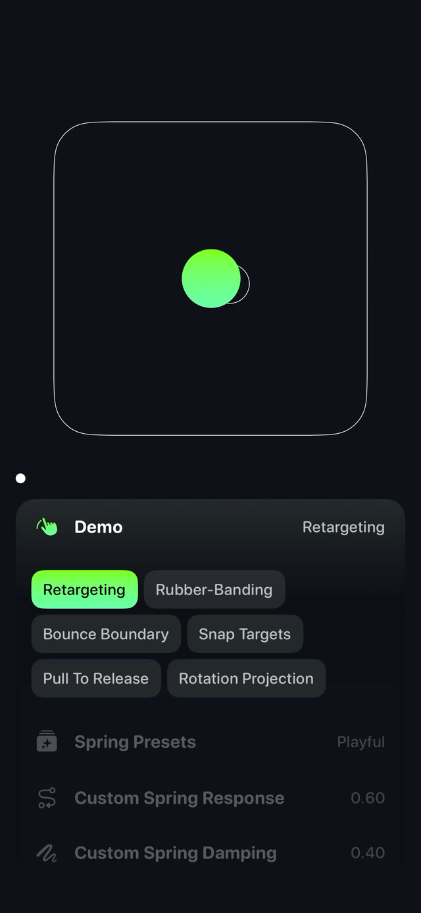
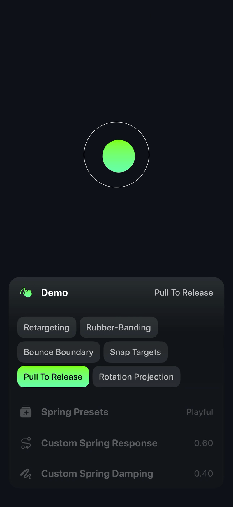

<picture>
  <source srcset="Resources/github-header-dark.svg" media="(prefers-color-scheme: dark)">
  
</picture>

**Tunable, physics-driven motion primitives for SwiftUI.**

Kinetics brings the natural feel of real-world physics to your SwiftUI animations. Built on Swift 6 with strict concurrency compliance, it provides a modern, safe foundation for creating motion that responds to user input, respects boundaries, and feels alive.

<p align="center">
  
  
  
</p>

<p align="center">
  
  
  
</p>

## ✨ Features

### 🎯 **Retargeting**
Change animation targets mid-flight and watch your UI smoothly redirect. Perfect for interactive elements that need to respond to user input in real-time.

```swift
@State private var target = CGPoint(x: 100, y: 100)
@State private var current = CGPoint.zero

var body: some View {
    Circle()
        .fill(.blue)
        .frame(width: 50, height: 50)
        .position(current)
        .kinetics(
            target: $target,
            current: $current,
            spring: .playful
        )
        .onTapGesture {
            // Retarget anywhere - animation smoothly redirects!
            target = CGPoint(x: .random(in: 0...300), y: .random(in: 0...300))
        }
}
```

### 🚀 **Tossing & Momentum**
Capture the energy of user gestures and let it carry through your animations. Natural momentum that feels responsive and delightful.

```swift
@State private var dragState = KineticsDragState()

var body: some View {
    Rectangle()
        .fill(.green)
        .frame(width: 100, height: 100)
        .kineticsDragGesture(state: $dragState)
        .onChange(of: dragState.isActive) { _, isActive in
            if !isActive {
                // Toss with captured momentum
                target = dragState.projectedTranslation
            }
        }
}
```

### 🦾 **Rubber-Banding**
iOS-native resistance when content exceeds boundaries. Smooth, natural feel that guides users back to valid ranges.

```swift
let rubberConfig = RubberBandConfig(
    constant: 0.55,  // Classic UIScrollView feel
    dimension: 300,
    mode: .outside(bounds: 0...200, freeOvershoot: 20)
)

var body: some View {
    Rectangle()
        .kinetics(
            target: $target,
            current: $current,
            spring: .snappy,
            boundary: .rubber(perComponent: [0: rubberConfig, 1: rubberConfig])
        )
}
```

### 🧲 **Snapping**
Intelligent snapping to meaningful positions. Perfect for dials, sliders, and any interface that needs to align with discrete values.

```swift
let snapConfig = RubberBandConfig(
    constant: 0.8,
    dimension: 100,
    mode: .inside(anchor: 0, bandUntil: 25, snapBackInside: true)
)

var body: some View {
    DialView()
        .kinetics(
            target: $target,
            current: $current,
            spring: .rigid,
            boundary: .rubber(perComponent: [0: snapConfig])
        )
}
```

### 🏀 **Bouncing**
Realistic collision response with configurable energy loss. Create interfaces that feel solid and responsive.

```swift
let bounceBoundary = BounceBoundary(
    xr: 0...300,
    yr: 0...500,
    restitution: 0.6,  // Bouncy but not too energetic
    friction: 0.1      // Smooth sliding along boundaries
)

var body: some View {
    BallView()
        .kinetics(
            target: $target,
            current: $current,
            spring: .bouncy,
            boundary: .bounce(bounceBoundary)
        )
}
```

### 🔮 **Projection**
Predict where motion will end and update your UI accordingly. Responsive interfaces that anticipate user intent.

```swift
@State private var rotationState = KineticsRotationState()

var body: some View {
    KnobView()
        .kineticsRotationGesture(
            state: $rotationState,
            velocityScale: 1.2,
            projectionFallbackTime: 0.4
        )
        .onChange(of: rotationState.projectedRotation) { _, projected in
            // Update UI based on where rotation will end
            updateKnobValue(projected)
        }
}
```

## 🎨 Spring Presets

Kinetics comes with carefully tuned spring configurations for every use case:

- **`.playful`** - Bouncy with clear overshoot (ζ=0.4, response=0.6s)
- **`.elastic`** - Springy with moderate bounce (ζ=0.5, response=0.5s)
- **`.bouncy`** - Responsive with light overshoot (ζ=0.6, response=0.4s)
- **`.snappy`** - Quick response with light overshoot (ζ=0.9, response=0.3s)
- **`.ultraSnappy`** - Lightning-fast response (ζ=0.9, response=0.15s)
- **`.rigid`** - Precise, no overshoot (ζ=1.2, response=0.3s)
- **`.gentle`** - Smooth and relaxed (ζ=1.0, response=0.8s)

Or create your own with precise control over damping ratio (ζ) and response time for exactly the feel you want.

## 🚀 Getting Started

### Installation

Add Kinetics to your Swift Package Manager dependencies:

```swift
dependencies: [
    .package(url: "https://github.com/your-username/Kinetics.git", from: "1.0.0")
]
```

### Basic Usage

```swift
import Kinetics

struct ContentView: View {
    @State private var target = CGPoint(x: 200, y: 200)
    @State private var current = CGPoint.zero
    
    var body: some View {
        Circle()
            .fill(.blue)
            .frame(width: 50, height: 50)
            .position(current)
            .kinetics(
                target: $target,
                current: $current,
                spring: .playful
            )
            .onTapGesture {
                target = CGPoint(x: .random(in: 0...400), y: .random(in: 0...400))
            }
    }
}
```

## 🎭 Why Kinetics?

**Traditional animations** feel robotic and disconnected from user input. **Kinetics** creates motion that:

- **Responds naturally** to user gestures and input
- **Respects boundaries** with intelligent collision handling
- **Maintains momentum** for fluid, continuous motion
- **Adapts in real-time** to changing targets and constraints
- **Feels alive** with physics-based spring dynamics

## 🔧 Architecture

Kinetics is built on a robust, modern foundation:

- **Swift 6 & strict concurrency** for safety and performance
- **Spring-mass-damper physics** for natural motion
- **Frame-based clock** for consistent timing
- **Generic value system** supporting any geometric type
- **Boundary abstraction** for flexible constraint handling
- **SwiftUI integration** with automatic lifecycle management

## 📱 Requirements

- iOS 15.0+ / macOS 12.0+ / tvOS 15.0+ / watchOS 8.0+
- Swift 6.0+
- Xcode 15.0+

## 🤝 Contributing

We love contributions! Whether it's bug reports, feature requests, or pull requests, your input helps make Kinetics better for everyone.

## 📄 License

Kinetics is available under the MIT license. See the [LICENSE](LICENSE) file for more info.